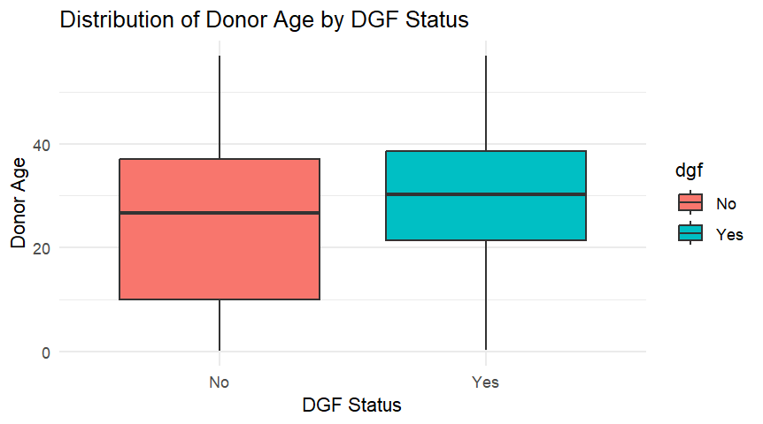
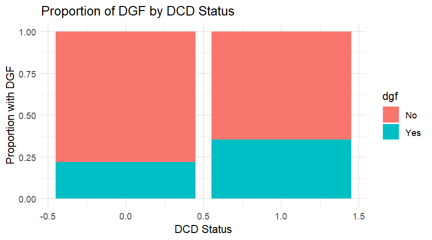

# 🧬 Predictors of Delayed Graft Function in Kidney Transplant Recipients

This project explores clinical predictors of **Delayed Graft Function (DGF)** using real-world transplant data and logistic regression modeling in R. 

---

## 🧠 Research Question

> What donor-level factors are significantly associated with delayed graft function in deceased-donor kidney transplant recipients?

---

## 📊 Objectives

- Analyze donor age and DCD status as key predictors of DGF  
- Test for potential confounding by race and gender  
- Evaluate effect modification (interaction) between donor age and DCD status  
- Visualize distributions and group differences  
- Build unadjusted, adjusted, and interaction logistic regression models  

---

## 📁 Project Structure

<pre> ``` dekaf-dgf-analysis/ ├── data/ │ └── cleaned_dekaf_dgf.csv ├── scripts/ │ └── 01_data_cleaning_analysis.R ├── output/ │ └── plots/ │ ├── boxplot_donor_age_by_dgf.png │ └── barplot_dgf_by_dcd_status.png └── README.md ``` </pre>


---

## 🔬 Methods Summary

- Data inspection and recoding with `dplyr`  
- Visualization with `ggplot2` (boxplot, proportion bar chart)  
- Chi-square test for associations  
- Logistic regression with:  
  - Main effects  
  - Adjusted models  
  - Interaction term (`agedonor16*dcd_yn`)  
- Confounding check using the **10% change-in-estimate rule**

---

## 📊 Visualizations

### Boxplot: Donor Age by DGF


### Barplot: Proportion of DGF by DCD Status


---

## 📈 Key Findings

- **Donor age**, **DCD status**, and **male gender** were independently associated with increased odds of DGF.  
- **Race** was not a statistically significant predictor and did **not act as a confounder** (β changed < 10%).  
- The **interaction between donor age and DCD status** was not statistically significant (p > 0.05) and did not improve model fit.

---

## 📦 Tools Used

- R (base + `dplyr`, `ggplot2`, `readxl`)  
- RStudio  
- GitHub  

---

## 📄 License

MIT License. Dataset is de-identified and for educational/demo purposes.

---

## 🙋‍♀️ Author

**Anandi Ganguli**  
MPH Epidemiology Candidate  
University of Minnesota
